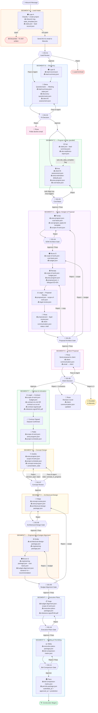

# Entrega Pipeline — Mermaid Flowchart

```mermaid
flowchart TD
    %% ─────────────────────────────────────────
    %% SEGMENT A — LEAD INTAKE
    %% ─────────────────────────────────────────
    IN([📩 Inbound Message]) --> LUPE_A

    subgraph SEG_A ["SEGMENT A — Lead Intake"]
        LUPE_A["🟠 Lupe A<br/>Classify + create project<br/>📥 inbound msg · state_template.json<br/>📤 state.json · lead-record.json"]
        LUPE_A -->|spam| DISCARD([🗑 Discarded · TC-007 written])
        LUPE_A -->|not spam| DG01_SEND[Send DG-01 email to Marcela]
    end

    DG01_SEND --> DG01

    %% ─────────────────────────────────────────
    %% DG-01
    %% ─────────────────────────────────────────
    DG01{{"🔵 DG-01<br/>Lead Review"}}
    DG01 -->|Reject| ARCHIVE([📁 Lead Archived])
    DG01 -->|Approve| LUPE_B
    DG01 -->|Pass to Agent| ELENA

    %% ─────────────────────────────────────────
    %% SEGMENT B — DISCOVERY
    %% ─────────────────────────────────────────
    subgraph SEG_B ["SEGMENT B — Discovery"]
        LUPE_B["🟠 Lupe B<br/>📥 lead-record.json<br/>📤 lead-summary.json"]
        LUPE_B --> ELENA
        ELENA["🔵 Elena<br/>Questionnaire → Meeting<br/>📥 lead-summary.json · state.json<br/>📤 discovery-questionnaire.json<br/>📤 client-fit-assessment.json"]
    end

    ELENA --> DG02

    %% ─────────────────────────────────────────
    %% DG-02
    %% ─────────────────────────────────────────
    DG02{{"🔵 DG-02<br/>Fit Decision"}}
    DG02 -->|Reject| ROSA_DECLINE["🌸 Rosa<br/>Polite decline email"]
    DG02 -->|Pass to Agent| ELENA
    DG02 -->|Approve| PARALLEL_START

    %% ─────────────────────────────────────────
    %% SEGMENT C — PARALLEL: ANA + SOL
    %% ─────────────────────────────────────────
    PARALLEL_START(( ))

    subgraph SEG_C ["SEGMENT C — Program & Site  ⟨parallel⟩"]
        direction LR
        ANA["🟢 Ana<br/>📥 client-fit-assessment.json<br/>📥 area-estimation-defaults.json<br/>📤 area-program.json<br/>📤 cost-basis.json"]
        SOL["🟡 Sol<br/>📥 state.json · lead-summary.json<br/>📤 site-readiness-report.json"]
    end

    PARALLEL_START --> ANA
    PARALLEL_START --> SOL
    ANA -->|both flags true<br/>Ana triggers| DG03
    SOL -.->|sets site_data_complete flag| ANA

    %% ─────────────────────────────────────────
    %% DG-03
    %% ─────────────────────────────────────────
    DG03{{"🔵 DG-03<br/>Cost Basis"}}
    DG03 -->|Reject| ANA
    DG03 -->|Approve / Pass| TOMAS

    %% ─────────────────────────────────────────
    %% SEGMENT D — SOW + BUDGET + PROPOSAL
    %% ─────────────────────────────────────────
    subgraph SEG_D ["SEGMENT D — Scope, Budget & Proposal"]
        TOMAS["🟠 Tomás<br/>📥 area-program.json · cost-basis.json<br/>📥 sow-[project_type].md template<br/>📤 scope-of-work.json"]
        TOMAS --> DG04
        DG04{{"🔵 DG-04<br/>SOW Architect Gate"}}
        DG04 -->|Reject| TOMAS
        DG04 -->|Approve / Pass| BRUNO_D
        BRUNO_D["🟠 Bruno D<br/>📥 scope-of-work.json · cost-basis.json<br/>📤 budget.json"]
        BRUNO_D --> RENATA
        RENATA["🟣 Renata<br/>📥 scope-of-work.json · budget.json<br/>📥 area-program.json<br/>📤 proposal.json ⚠ bilingual ES+EN"]
        RENATA --> LEGAL_D
        LEGAL_D["⚖ Legal — Proposal Review<br/>📥 proposal.json · scope-of-work.json<br/>📤 legal-review.json"]
        LEGAL_D --> ROSA_DRAFT
        ROSA_DRAFT["🌸 Rosa<br/>📥 proposal.json · legal-review.json<br/>📤 client-communication.json<br/>status: draft"]
    end

    ROSA_DRAFT --> DG05

    %% ─────────────────────────────────────────
    %% DG-05
    %% ─────────────────────────────────────────
    DG05{{"🔵 DG-05<br/>Proposal Architect Gate"}}
    DG05 -->|Reject — copy| RENATA
    DG05 -->|Reject — scope| TOMAS
    DG05 -->|Reject — budget| BRUNO_D
    DG05 -->|Approve / Pass| ROSA_SEND

    %% ─────────────────────────────────────────
    %% SEGMENT E — CLIENT NEGOTIATION
    %% ─────────────────────────────────────────
    subgraph SEG_E ["SEGMENT E — Client Proposal"]
        ROSA_SEND["🌸 Rosa<br/>Send proposal to client<br/>📥 client-communication.json<br/>📤 email → client"]
    end

    ROSA_SEND --> DG06

    %% ─────────────────────────────────────────
    %% DG-06
    %% ─────────────────────────────────────────
    DG06{{"🔵 DG-06<br/>Client Decision"}}
    DG06 -->|Pass to Agent| ROSA_SEND
    DG06 -->|Reject < 3 revisions| ROSA_REV["🌸 Rosa<br/>Revision round<br/>📤 client-communication.json updated"]
    ROSA_REV --> DG06
    DG06 -->|Reject ≥ 3| ESCALATE(["⚠ Escalate<br/>to Marcela"])
    DG06 -->|Approve| LEGAL_F

    %% ─────────────────────────────────────────
    %% SEGMENT F — CONTRACT + ACTIVATION
    %% ─────────────────────────────────────────
    subgraph SEG_F ["SEGMENT F — Contract & Activation"]
        LEGAL_F["⚖ Legal — Contract<br/>📥 scope-of-work.json · budget.json<br/>📥 contract-mx.md OR contract-us-ca.md<br/>📤 contract-signed.pdf<br/>📤 milestone-signoff-M1.pdf"]
        LEGAL_F --> CONTRACT["✅ Contract Signed<br/>Deposit Confirmed"]
        CONTRACT --> PABLO["📅 Pablo<br/>📥 scope-of-work.json · area-program.json<br/>📤 project-schedule.json"]
    end

    PABLO --> ANDRES

    %% ─────────────────────────────────────────
    %% SEGMENT G — CONCEPT DESIGN
    %% ─────────────────────────────────────────
    subgraph SEG_G ["SEGMENT G — Concept Design"]
        ANDRES["✏ Andrés<br/>📥 area-program.json · scope-of-work.json<br/>📥 project-schedule.json<br/>📤 concept-review.json<br/>+ presentation_date"]
    end

    ANDRES --> DG07

    %% ─────────────────────────────────────────
    %% DG-07
    %% ─────────────────────────────────────────
    DG07{{"🔵 DG-07<br/>Concept Review"}}
    DG07 -->|Reject<br/>decision_type: reject| ANDRES
    DG07 -->|Pass to Agent<br/>state: concept_in_progress| ANDRES
    DG07 -->|Approve| FELIPE

    %% ─────────────────────────────────────────
    %% SEGMENT H — ARCHITECTURAL DESIGN
    %% ─────────────────────────────────────────
    subgraph SEG_H ["SEGMENT H — Architectural Design"]
        FELIPE["📐 Felipe<br/>📥 concept-review.json<br/>📥 area-program.json<br/>📤 architectural-design-package.json"]
    end

    FELIPE --> DG08

    %% ─────────────────────────────────────────
    %% DG-08
    %% ─────────────────────────────────────────
    DG08{{"🔵 DG-08<br/>Architectural Design Gate"}}
    DG08 -->|Reject| FELIPE
    DG08 -->|Approve / Pass| EMILIO

    %% ─────────────────────────────────────────
    %% SEGMENT I — ENGINEERING + BUDGET ALIGNMENT
    %% ─────────────────────────────────────────
    subgraph SEG_I ["SEGMENT I — Engineering & Budget Alignment"]
        EMILIO["⚙ Emilio<br/>📥 architectural-design-package.json<br/>📤 engineering-package.json"]
        EMILIO --> BRUNO_G
        BRUNO_G["🟠 Bruno G<br/>📥 engineering-package.json · cost-basis.json<br/>📤 budget-alignment.json<br/>variance % + recommendation"]
    end

    BRUNO_G --> DG09

    %% ─────────────────────────────────────────
    %% DG-09
    %% ─────────────────────────────────────────
    DG09{{"🔵 DG-09<br/>Budget Alignment Gate"}}
    DG09 -->|Reject — scope| FELIPE
    DG09 -->|Reject — budget| EMILIO
    DG09 -->|Approve / Pass| HUGO

    %% ─────────────────────────────────────────
    %% SEGMENT J — EXECUTIVE PLANS
    %% ─────────────────────────────────────────
    subgraph SEG_J ["SEGMENT J — Executive Plans"]
        HUGO["📋 Hugo<br/>📥 budget-alignment.json · scope-of-work.json<br/>📤 executive-plans-package.json<br/>📤 milestone-signoff-M4.pdf"]
    end

    HUGO --> DG10

    %% ─────────────────────────────────────────
    %% DG-10
    %% ─────────────────────────────────────────
    DG10{{"🔵 DG-10<br/>Executive Plans Gate"}}
    DG10 -->|Reject| HUGO
    DG10 -->|Approve / Pass| OFELIA

    %% ─────────────────────────────────────────
    %% SEGMENT K — BIDDING + PERMITTING
    %% ─────────────────────────────────────────
    subgraph SEG_K ["SEGMENT K — Bidding & Permitting"]
        OFELIA["📊 Ofelia<br/>📥 executive-plans-package.json<br/>📤 bid-comparison-matrix.json"]
        OFELIA --> DG11
        DG11{{"🔵 DG-11<br/>Bid Comparison Gate"}}
        DG11 -->|Reject / Pass| OFELIA
        DG11 -->|Approve| PACO
        PACO["🏛 Paco<br/>📥 bid-comparison-matrix.json<br/>📤 permits-package.json<br/>submitted_at + approved_at + jurisdiction"]
    end

    PACO --> CONSTRUCTION([🏗 Construction Begins])

    %% ─────────────────────────────────────────
    %% STYLES
    %% ─────────────────────────────────────────
    style SEG_A fill:#fff7ed,stroke:#f97316
    style SEG_B fill:#eff6ff,stroke:#3b82f6
    style SEG_C fill:#f0fdf4,stroke:#22c55e
    style SEG_D fill:#fdf4ff,stroke:#a855f7
    style SEG_E fill:#fdf4ff,stroke:#ec4899
    style SEG_F fill:#f0fdf4,stroke:#16a34a
    style SEG_G fill:#fffbeb,stroke:#f59e0b
    style SEG_H fill:#fffbeb,stroke:#d97706
    style SEG_I fill:#fff7ed,stroke:#ea580c
    style SEG_J fill:#eff6ff,stroke:#6366f1
    style SEG_K fill:#f0f9ff,stroke:#0284c7

    style DISCARD fill:#fee2e2,stroke:#ef4444
    style ARCHIVE fill:#fee2e2,stroke:#ef4444
    style ROSA_DECLINE fill:#fce7f3,stroke:#ec4899
    style ESCALATE fill:#fef3c7,stroke:#f59e0b
    style CONSTRUCTION fill:#dcfce7,stroke:#16a34a
```
